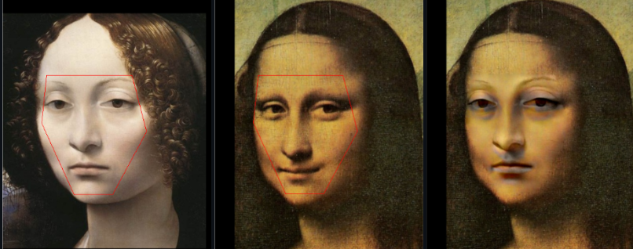
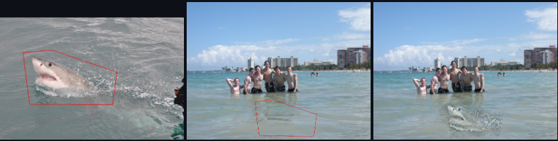
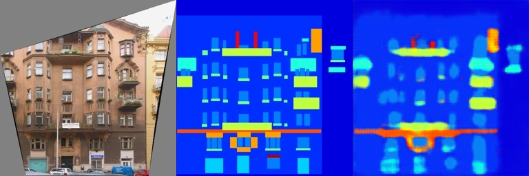
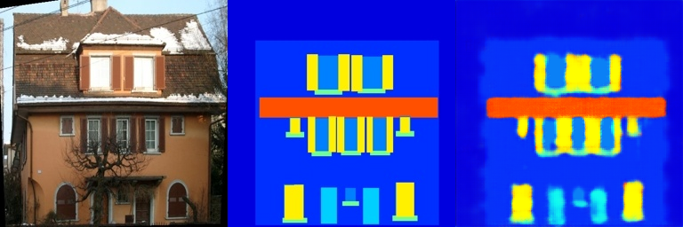
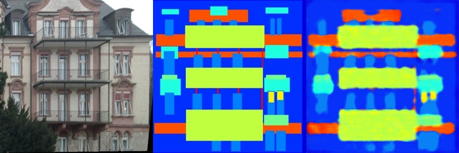
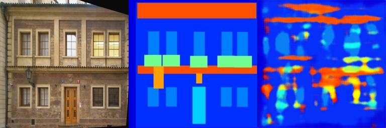
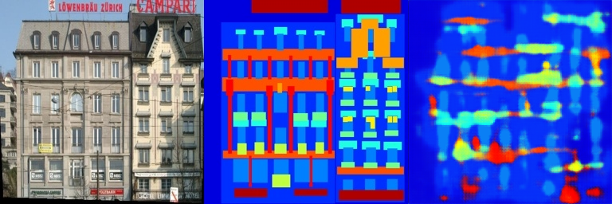
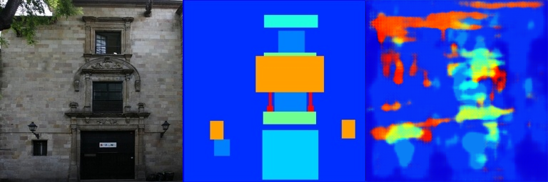

# Assignment 2 - DIP with PyTorch

### This is Bei's implementation of DIP assignment 2.

### Resources:
- [Assignment Slides](https://rec.ustc.edu.cn/share/705bfa50-6e53-11ef-b955-bb76c0fede49)  
- [Paper: Poisson Image Editing](https://www.cs.jhu.edu/~misha/Fall07/Papers/Perez03.pdf)
- [Paper: Image-to-Image Translation with Conditional Adversarial Nets](https://phillipi.github.io/pix2pix/)
- [Paper: Fully Convolutional Networks for Semantic Segmentation](https://arxiv.org/abs/1411.4038)
- [PyTorch Installation & Docs](https://pytorch.org/)

---

## Requirements

To install requirements:

```setup
python -m pip install -r requirements.txt
```


## Running

To run Poisson Image Editing, run:

```blend
python run_blending_gradio.py
```

To run Pix2Pix training, run:

```learning
python train.py
```

## Results 
### Poisson Image Editing
<center>
    
</center>
<center>
    
</center>

### Pix2Pix:
#### train_results
<center>
    
</center>
<center>
    
</center>
<center>
    
</center>

#### val_results
<center>
    
</center>
<center>
    
</center>
<center>
    
</center>

The results on the test set are clearly not as good as those on the training set.