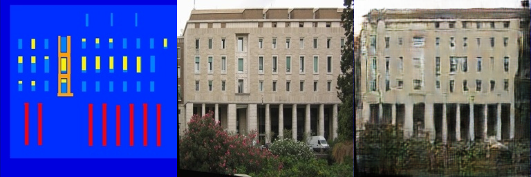
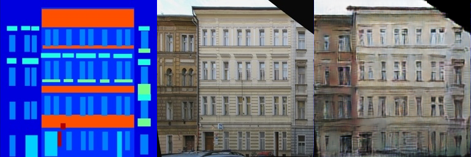
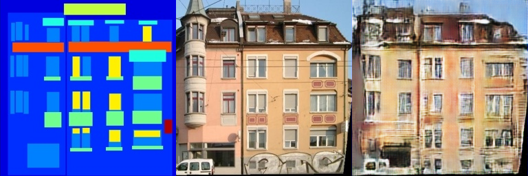
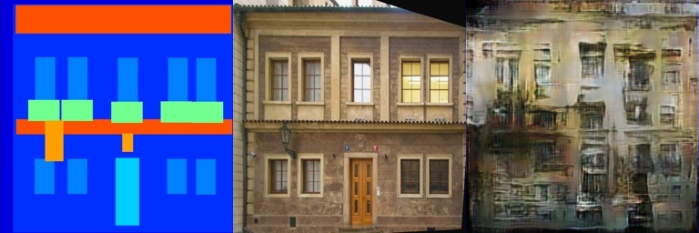
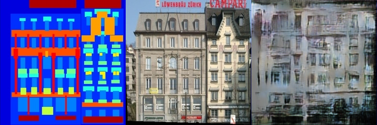
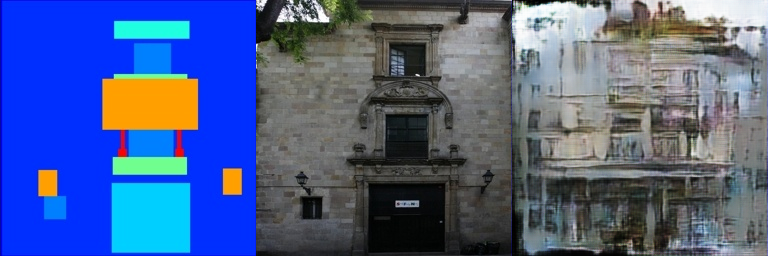

# Assignment 3 - Play with GANs

### This is Bei's impletation of DIP assignment3

### Resources:
- [DragGAN](https://vcai.mpi-inf.mpg.de/projects/DragGAN/): [Implementaion 1](https://github.com/XingangPan/DragGAN) & [Implementaion 2](https://github.com/OpenGVLab/DragGAN)
- [Facial Landmarks Detection](https://github.com/1adrianb/face-alignment)

---
## Pix2Pix with GAN

### Requirements
Based on enviroment and dataset used in homework2.

To run training

```train
python train.py
```

Noted, one should adjust batch size in line 142, 143 according to VRAM, otherwise the training will be extremely slow.

### Results

#### train results
<center>
    
</center>
<center>
    
</center>
<center>
    
</center>

#### val results
<center>
    
</center>
<center>
    
</center>
<center>
    
</center>

GAN gets better result than FCN_network.

## DragGAN

### Requirements

We can refer to the installation guide of [XingangPan](https://github.com/XingangPan/DragGAN), which is also copied here. Another installation guide is [Zhihu](https://zhuanlan.zhihu.com/p/640448480?utm_medium=social&utm_psn=1842335797300314112&utm_source=qq).

If you have CUDA graphic card, please follow the requirements of [NVlabs/stylegan3](https://github.com/NVlabs/stylegan3#requirements).  

The usual installation steps involve the following commands, they should set up the correct CUDA version and all the python packages

```
conda env create -f environment.yml
conda activate stylegan3
```

Then install the additional requirements

```
pip install -r requirements.txt
```

Otherwise (for GPU acceleration on MacOS with Silicon Mac M1/M2, or just CPU) try the following:

```sh
cat environment.yml | \
  grep -v -E 'nvidia|cuda' > environment-no-nvidia.yml && \
    conda env create -f environment-no-nvidia.yml
conda activate stylegan3

# On MacOS
export PYTORCH_ENABLE_MPS_FALLBACK=1
```

To download pre-trained weights, simply run:

```
python scripts/download_model.py
```
To start the DragGAN GUI, simply run:
```
.\scripts\gui.bat
```

### Results
<video controls src="result_video.mp4" title="Title"></video>